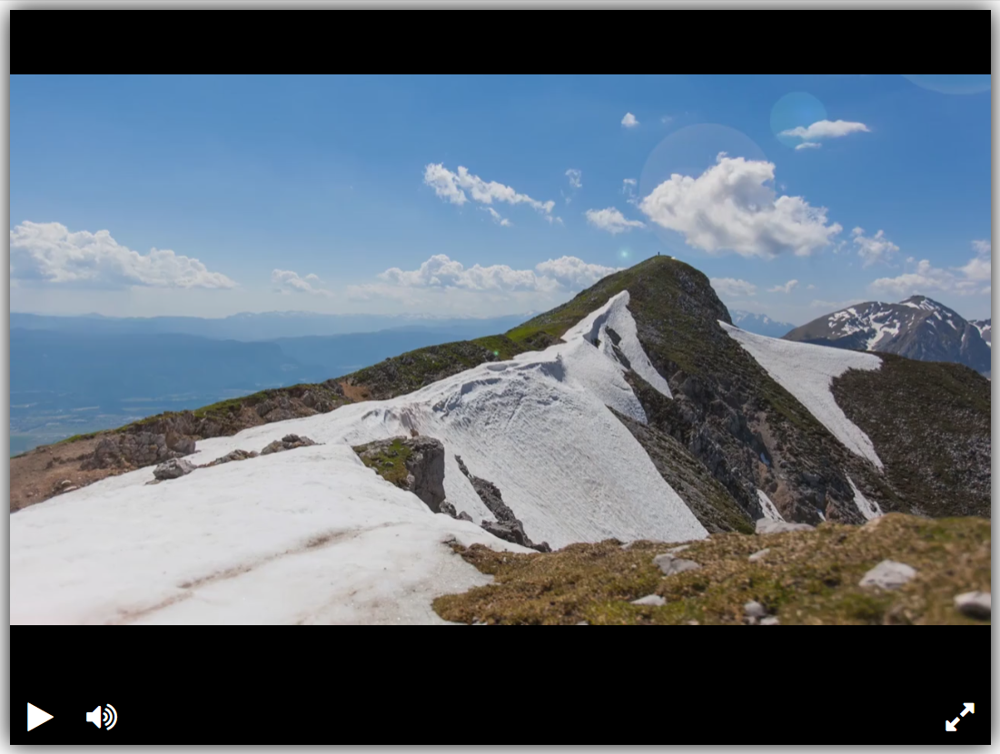

# Видеоплеер

Шаблон сайта с видеопроигрывателем и готовыми рабочими кнопками.
Ознакомиться с сайтом можно [по ссылке GitHub Pages](https://george-salt.github.io/videoplayer).



## Установка

Скачайте форк [репозитория](https://github.com/George-Salt/videoplayer) с проектом.
Сервер запускается с помощью livereload. Его необходимо установить командой:

```sh
pip install livereload
```

## Запуск

Введите команду в папке проекта:

```sh
livereload project
```

Посмотреть его можно на [сайте плеера](http://127.0.0.1:35729).

## Цель

Это урок в курсе по программированию от Devman.
